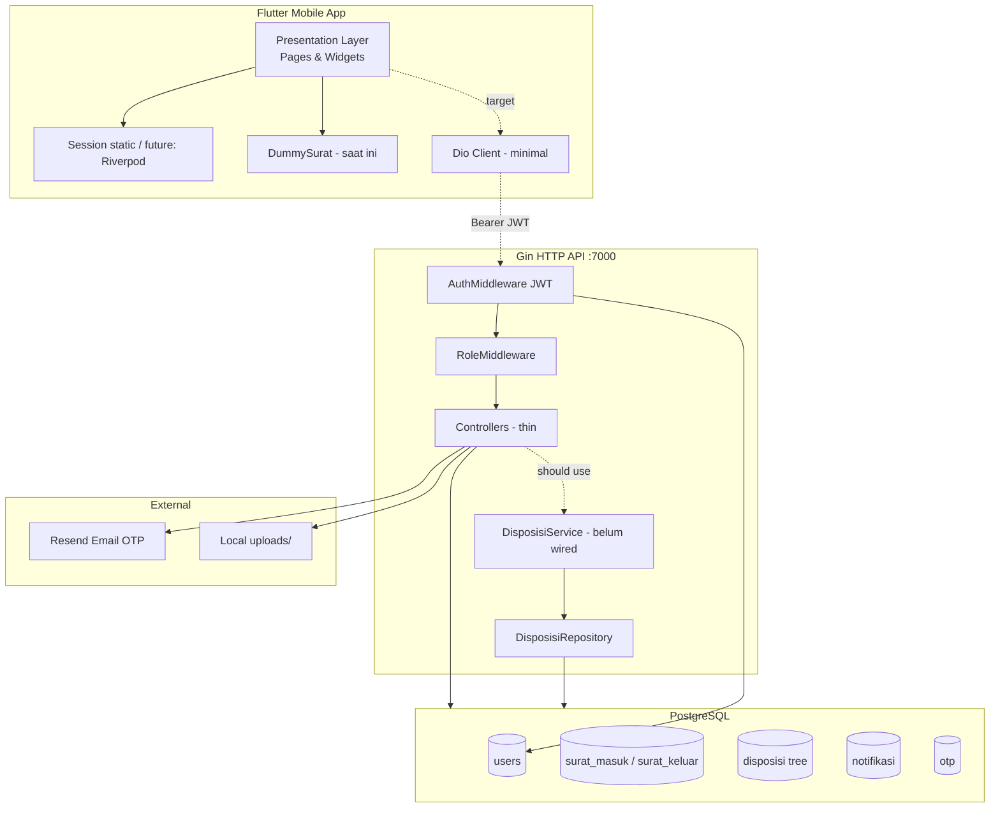

Berikut analisis arsitektur dan alur sistem berdasarkan codebase `front-end/` (Flutter) dan `disposisi-backend/` (Go/Gin).

---

## 1. Ringkasan aplikasi

### Fungsi utama
**E-Disposisi** adalah aplikasi mobile untuk mengelola **surat masuk** dan **surat keluar** di lingkungan sekolah (SMKN 2 Singosari), dengan fokus pada:
- Penerimaan dan pencatatan surat (Tata Usaha)
- Persetujuan / penolakan dan **disposisi** (Kepala Sekolah)
- Penerusan ke **Waka** atau **pengguna** (guru/staff)
- Riwayat, notifikasi, profil, dan panduan onboarding per role

### Role yang tersedia

| Layer | Role |
|--------|------|
| **Frontend** (`Role` enum) | `tu`, `kepsek`, `users`, `wakaKurikulum`, `wakaKesiswaan`, `wakaHumas`, `wakaSarpras` |
| **Backend** (middleware) | `Admin`, `TU`, `Kepala TU`, `Kepala Sekolah` (+ jabatan di DB: `KEPALA_SEKOLAH`, `WAKIL_*`, `TATA_USAHA`, `GURU`, dll.) |

**Gap kritis:** penamaan dan pemetaan role frontend ↔ backend belum disatukan.

### Tujuan sistem
Mendigitalisasi alur kantor surat: dari surat masuk eksternal → verifikasi Kepsek → disposisi berantai → konfirmasi/baca penerima → penutupan status, sesuai `disposisi-backend/flow.md`.

**Kondisi aktual:** UI/UX dan prototipe alur sudah jalan di frontend dengan **data dummy**; backend punya fondasi API/DB/service yang **belum terhubung** ke aplikasi mobile.

---

## 2. Workflow sistem

### 2.1 User login

| Langkah | Alur |
|---------|------|
| **User Action** | Input email + password, tap Masuk |
| **UI** | `Login` (`login_page.dart`) |
| **State** | `_emailError`, `_passwordError`, `_isLoading`; validasi terhadap `_validEmails` hardcoded |
| **API** | ❌ Tidak ada — `Future.delayed(800ms)` lalu if-else credential |
| **Backend Response** | — (backend punya `POST /auth/login` → `{ "token": "..." }` tetapi tidak dipanggil) |
| **UI Update** | `Session.*` diisi → `Navigator.pushReplacement` ke `PanduanPage` |

**Root cause:** frontend masih **prototipe offline**; `dio` dan `shared_preferences` ada di `pubspec.yaml` tetapi tidak dipakai untuk auth.

---

### 2.2 Role checking

| Langkah | Alur |
|---------|------|
| **User Action** | Login sukses |
| **UI** | `PanduanPage._finish()` memilih `MenuUser` vs `Home` |
| **State** | `Session.role`, `Session.jabatan` (static global) |
| **API** | ❌ |
| **Backend** | JWT seharusnya membawa `roles[]`; saat ini `GenerateToken(user.ID, []string{})` — **array kosong** → `RoleMiddleware` akan **403** untuk route terproteksi |
| **UI Update** | Navigasi berdasarkan `Role` enum Flutter, bukan claim JWT |

---

### 2.3 Pengambilan data

| Role | Sumber data |
|------|-------------|
| Semua halaman daftar | `DummySurat.allSurat` (`core/mocks/dummy.dart`) |
| Notifikasi | `notifTU`, `notifKepsek`, `notifUser` (`notification_template.dart`) |
| Filter user/Waka | `diteruskanKe`, `jabatan`, `jenisSurat` pada `Map` lokal |

| Langkah | Alur |
|---------|------|
| **User Action** | Buka Home / Menu / History |
| **UI** | `Home`, `TuDashboardPage`, `MenuUser`, dll. |
| **State** | Getter filter di `StatefulWidget` (`_searchQuery`, `_selectedFilter`) |
| **API** | ❌ (backend: `GET /surat`, `GET /disposisi`, `GET /dashboard`) |
| **Backend Response** | — |
| **UI Update** | `setState` → rebuild `ListView` |

---

### 2.4 Disposisi surat (Kepsek — surat masuk)

| Langkah | Alur |
|---------|------|
| **User Action** | Buka surat → pilih Terima/Tolak → isi form → Kirim → Konfirmasi |
| **UI** | `InputSuratMasuk` |
| **State** | `_selectedStatus`, `selectedTujuan`, controller teks |
| **API** | ❌ — `_submitDisposisi()` hanya `debugPrint` + `Navigator.pop` |
| **Backend (desain)** | `POST /disposisi` atau service `ForwardDisposisi` / `CreateInitialDisposisi` |
| **UI Update** | Kembali ke dashboard; **status di dummy tidak berubah** |

**Alur bisnis yang diharapkan** (`flow.md`): TU input → ke Kepsek → acc → update status → kirim ke penerima.

---

### 2.5 Konfirmasi surat

| Role | Perilaku UI |
|------|-------------|
| **TU** | Surat `diproses` → `showProcessDialog`; `disetujui`/`ditolak` → `OutputSuratmasuk` / `OutputSuratkeluar` |
| **Kepsek** | Dialog konfirmasi sebelum submit disposisi |
| **User/Waka** | `DetailSuratUsers` — konfirmasi disposisi lanjutan (mock `_dummyPenerima`) |

Tidak ada persistensi “sudah dibaca” ke backend (`MarkAsRead` ada di service tapi tidak di route controller).

---

### 2.6 Forward surat

| Actor | Frontend | Backend (siap, belum ter-wire) |
|-------|----------|--------------------------------|
| Kepsek → Waka/User | Multi-select `selectedTujuan` | `ForwardDisposisi` + parent-child `Disposisi` tree |
| Waka → bawahan | `DetailSuratUsers` + dropdown penerima dummy | Chain `level` + `PermissionService` |

Filter inbox Waka di `menu_user_page.dart`:

```dart
if (isWaka) {
  return diteruskanKe.startsWith('waka_');  // semua Waka lihat SEMUA surat waka_*
}
```

**Bug bisnis:** Waka Kurikulum juga melihat surat untuk `waka_kesiswaan`, dll.

---

### 2.7 History surat

| Role | Halaman | Data |
|------|---------|------|
| TU | `HistoryTUPage` | Dummy + filter status |
| Kepsek | `HistoryKepsekPage` | Dummy |
| User/Waka | `HistoryUsersPage` | Dummy + `FilterDate` |

Navbar index 1 → `handleNavbarTap` → `pushReplacementNamed` atau `HistoryUsersPage`.

---

### 2.8 Logout

| Langkah | Alur |
|---------|------|
| **User Action** | Profile → Keluar → konfirmasi |
| **UI** | `ProfilePage` |
| **State** | `Session` **tidak di-reset** |
| **API** | ❌ |
| **Backend** | Tidak ada revoke token |
| **UI Update** | `pushAndRemoveUntil` → `Login` |

**Risiko:** session in-memory tetap berisi data user sebelumnya; tidak ada clear token.

---

## 3. Navigation Flow

### Diagram utama

```
SplashScreen (5 detik)
    → Login (/signin)
        → PanduanPage (onboarding, first login)
            → [TU/Kepsek] Home
            → [User/Waka] MenuUser

Home (TU/Kepsek only)
    ├→ NotificationPage (push)
    ├→ TuDashboardPage / KepsekDashboardPage (push, by jenis surat)
    │       ├→ InputSuratMasuk (Kepsek, push)
    │       ├→ InputSuratKeluar (Kepsek, push)
    │       ├→ OutputSuratmasuk / OutputSuratkeluar (TU, push)
    │       └→ process_dialog (TU, status diproses)
    └→ openDetail from home list

MenuUser (User + Waka)
    ├→ NotificationPage
    └→ DetailSuratUsers (push)
            └→ FullScreenImageViewer (push)

CustomNavbar (3 tab: Home/History/Profile)
    → handleNavbarTap → pushReplacement / pushReplacementNamed
```

### Push vs Pop
- **Push:** detail surat, notifikasi, panduan dari profile, forgot password flow, image viewer.
- **Pop:** setelah submit disposisi Kepsek, batal dialog, back dari detail.
- **Replacement:** login → panduan → home; **seluruh tab navbar** memakai `pushReplacement` → stack tidak deep, tapi **state halaman lama hilang** (filter/search reset).

### Navigasi bersyarat role

| Kondisi | Destinasi |
|---------|-----------|
| `Role.tu` \| `Role.kepsek` | `Home` |
| User + semua Waka | `MenuUser` |
| Navbar tab 0 + user role | `MenuUser` bukan `Home` |
| `Home._initNotifications` untuk Waka | **`UnimplementedError`** jika Waka somehow masuk `Home` |

Route terdaftar di `app.dart` (`/menu_tu`, `/history_tu`, …) tetapi banyak navigasi memakai **`MaterialPageRoute` langsung**, bukan named routes → inkonsistensi.

**Anti-pattern:** route `/notif` hardcode `Role.tu` dan `notifications: const []`.

---

## 4. State Management Analysis

### Shared state
- **`Session`** — static mutable (`nama`, `email`, `jabatan`, `role`); satu-satunya “global session”.
- **`DummySurat.allSurat`** — static list; **tidak pernah di-update** setelah aksi UI.
- **Notifikasi** — disalin per halaman (`List.from(notifTU)`), dimutasi `isRead` lokal.

### Session usage
- Di-set di login; dibaca di `DetailSuratUsers`, `ProfilePage` (`_canChangePassword`).
- **Tidak persist** — `shared_preferences` tidak digunakan di codebase.
- Logout tidak clear `Session`.

### Widget state
- Hampir semua logika di `StatefulWidget`: search, filter, form disposisi, loading flag.
- Duplikasi getter `_filteredSurat` di 5+ file.

### Potensi masalah

| Issue | Dampak |
|-------|--------|
| Static `Session` | Race jika multi-window; tidak aman untuk production |
| Dummy tidak mutasi | User pikir disposisi terkirim, data tidak berubah |
| `Home` + Waka | Crash `UnimplementedError` |
| Navbar `pushReplacement` | Kehilangan state, rebuild penuh tiap tab |
| Controller dispose | Umumnya baik di form panjang (`InputSuratMasuk`) |
| Logout tanpa clear Session | Stale role di memory |

### Rebuild & memory
- `setState` pada setiap keystroke search — acceptable untuk list kecil.
- `TweenAnimationBuilder` di navbar tiap icon — rebuild ringan.
- Timer splash 5 detik — di-cancel implicit lewat `mounted` check ✓.

---

## 5. Data Flow Analysis

### Payload surat (frontend — dummy)

```dart
{
  'id': int,
  'jenisSurat': 'Surat Masuk' | 'Surat Keluar',
  'tanggal': String,           // display only, bukan ISO date
  'status': 'diproses' | 'disetujui' | 'ditolak',
  'fromRole' / 'toRole': String,
  'diteruskanKe': 'waka_kurikulum' | 'user' | ...,
  'catatan': String,
  'data': { 'Nomor Surat', 'Tanggal Surat', 'Dari', 'Perihal' },
  'lampiran': List<String>,    // asset paths, bukan URL server
}
```

### Backend (model nyata)

- `SuratMasuk`: `no_surat`, `perihal_surat`, `file_pdf`, `status_alur`
- `Disposisi`: `surat_masuk_id`, `from_user_id`, `to_user_id`, `status` = `pending|forwarded|completed|rejected`, `parent_disposisi_id`, `level`

### Field penting — mapping & gap

| Field | Frontend | Backend | Gap |
|-------|----------|---------|-----|
| **id** | `int` di Map | `uint` PK | OK konsep, perlu parsing JSON |
| **diteruskanKe** | string slug | `to_user_id` | Perlu lookup user/jabatan |
| **role** | enum lokal | JWT `roles` + jabatan | Tidak ter-map |
| **jabatan** | string bebas | `jabatan.nama_jabatan` | Inkonsisten (`waka_kurikulum` vs `WAKIL_KURIKULUM`) |
| **lampiran** | asset lokal | `file_pdf` path server | Perlu download + auth header |
| **status** | disetujui/ditolak/diproses | pending/forwarded/completed/rejected | **Tidak kompatibel** tanpa adapter layer |

### API contract
- Dokumentasi lengkap di `openapi.yaml` (login, surat, disposisi, dashboard).
- Implementasi controller **lebih sempit** daripada OpenAPI/service (mis. `GetDisposisi` mengabaikan `:surat_id`, `ListDisposisi` return semua row).

### Dummy & hardcoded
- 7 akun login + password `123456`
- 8 surat dummy
- Penerima disposisi Waka: list konstan di `detail_surat_user.dart`
- Notifikasi template statis

### Backend dependency (frontend)
**Saat ini: 0% integrasi bisnis.** Satu-satunya pemakaian `dio`: download gambar di `full-imges-viewer.dart`.

---

## 6. Architecture Review

### Struktur folder

**Frontend (`front-end/lib/`):**
```
core/          constants, mocks, helpers, utils
features/      home, tata_usaha, kepsek, users, profile, notifications
shared/        auth, widgets
app.dart       route table
```
→ Feature-first, **tanpa** `data/`, `domain/`, `presentation/` terpisah.

**Backend (`disposisi-backend/`):**
```
controllers/   HTTP handlers (thin seharusnya,实际 fat + DB langsung)
services/      business logic lengkap (TIDAK dipakai controller)
repositories/  query layer (TIDAK dipakai controller)
models/, dto/, middlewares/, helpers/
```
→ **Dual architecture:** dokumentasi Clean Architecture vs runtime “controller → GORM langsung”.

### Penilaian

| Aspek | Skor | Catatan |
|-------|------|---------|
| Modular (frontend) | Sedang | Feature folder jelas, logic duplikat |
| Modular (backend) | Rendah-Sedang | Layer ada, tidak terintegrasi |
| Scalable | Rendah | Tanpa pagination FE, list global DB, upload lokal |
| Maintainable | Sedang | File sedikit tapi Map<String,dynamic> everywhere |
| Clean-arch friendly | Rendah (FE), Sedang potensi (BE) | Perlu wiring + repository di controller |

### Kelebihan
- UI role-based sudah terpikir (TU / Kepsek / User / Waka).
- Komponen shared: `SuratCard`, `CustomNavbar`, `SearchBarInput`, `FilterDate`.
- Backend: model disposisi tree, migration indexes, service forward/complete/reject, OpenAPI.
- Onboarding `PanduanPage` per role — UX baik untuk first-time user.

### Kekurangan & technical debt
1. **Frontend–backend disconnect** — debt terbesar.
2. **Dua implementasi disposisi** di backend (controller sederhana vs `DisposisiServiceImpl` lengkap).
3. **JWT tanpa roles** — auth middleware tidak fungsional untuk RBAC.
4. **Status vocabulary mismatch** FE/BE.
5. **CORS** hanya `localhost:5500` — mobile app tidak tercakup.
6. **Tidak ada repository pattern di main.go** — DI hanya di dokumentasi.
7. **41 file Dart, ~30 file Go** — masih manageable, tapi akan meledak saat integrasi tanpa refactor.

### Production scale?
**Belum aman.** Alasan:
- Auth prototype, tidak ada refresh/revoke, password hardcoded di client.
- Data tidak konsisten antar device/user.
- Backend list endpoints tanpa filter user → kebocoran data jika dipakai apa adanya.
- File upload ke folder lokal server — tidak HA, tidak CDN.
- Tidak ada observability, rate limit (kecuali OTP), audit log terhubung ke FE.

**Jika user bertambah (100 → 1000+):**
- `ListDisposisi` / `Find` semua row → DB & payload bottleneck.
- Static dummy diganti DB tanpa pagination → UI freeze.
- Disposisi tree per surat perlu index (sudah ada di migration) + query scoped `to_user_id`.
- Perlu queue notifikasi (email/push), bukan list in-memory.

---

## 7. UI/UX Review

| Aspek | Temuan |
|-------|--------|
| **Hierarchy** | Header + stat card + list — jelas untuk TU/Kepsek |
| **Spacing** | Campuran fixed px dan `% width` — cukup responsif |
| **Typography** | Font default Material; judul bold konsisten |
| **Responsiveness** | Pola `rf()` duplikat di banyak file; `ConstrainedBox(maxWidth: 600-700)` di beberapa halaman |
| **Accessibility** | Label form ada; semantic/screen reader tidak dioptimalkan |
| **Consistency** | Warna utama `#0F6E7A` vs `AppColors.bluePrimary`; AppBar bg kadang `AppColors.bg` kadang `#F2F2F2` |
| **User flow** | Panduan → home bagus; tab navbar reset state kurang ideal |
| **Transitions** | `NoAnimationTransitionBuilder` — terasa “kaku” tapi konsisten |

Waka/User: hanya **Surat Masuk** di menu — sesuai fokus penerima disposisi.

---

## 8. Bug & Risk Detection

| Kategori | Temuan |
|----------|--------|
| **Hardcoded** | Login credentials, `_validEmails`, dummy surat, `/notif` route |
| **Duplicate code** | Filter surat, `rf()`, navigasi dashboard TU/Kepsek hampir identik |
| **Null safety** | `ModalRoute.of(context)!.settings.arguments` — crash jika args null |
| **Navigation** | Campuran named route + anonymous `MaterialPageRoute` |
| **Async** | Login fake delay tanpa cancel token; forgot password kemungkinan mock |
| **Separation** | Business rules di widget build methods |
| **Integrasi backend** | JWT kosong roles; FE status ≠ BE status; FE slug ≠ BE user id |
| **Waka filter** | `startsWith('waka_')` — salah target penerima |
| **Home crash** | Waka + `UnimplementedError` di notifications |
| **GetDisposisi** | Route param `surat_id` diabaikan — return all |
| **Logout** | Session tidak cleared |
| **shared_preferences** | Dead dependency |

---

## 9. Refactor Recommendation

### Prioritas refactor

**P0 — Critical (quick fix + fondasi)**
1. Layer **API client** (`dio` + interceptors JWT).
2. Login → `POST /auth/login`, simpan token (`shared_preferences`).
3. **Adapter status** FE ↔ BE.
4. Fix JWT: load jabatan/roles user saat login.
5. Fix filter Waka: `diteruskanKe == jabatan` atau match `Role`.
6. Clear `Session` + token on logout.
7. Hapus / implement `UnimplementedError` untuk Waka di `Home`.

**P1 — Medium**
8. Extract `SuratRepository` + model typed (`SuratModel`).
9. Satu `AuthBloc` / `Riverpod` untuk session.
10. Wire controller backend ke `DisposisiService`.
11. Pagination + filter `to_user_id` di list API.
12. Named routes + `go_router` dengan guard role.

**P2 — Major architecture**
13. Clean Architecture FE: `domain/`, `data/`, `presentation/`.
14. DI backend di `main.go` (wire repository → service → handler).
15. Object storage untuk PDF, signed URL.
16. Push notification (FCM) menggantikan list mock.

### Struktur folder ideal (frontend)

```
lib/
  app/                 router, theme, di
  core/                network, errors, constants
  domain/              entities, repositories (abstract)
  data/                models, dto, api, repository impl
  presentation/
    features/<role>/   pages + controllers
  shared/widgets/
```

### Service layer ideal
- `AuthService`, `SuratService`, `DisposisiService`, `NotificationService`
- Semua return `Either<Failure, T>` atau throw typed exceptions → UI hanya render state.

### State management
**Riverpod** atau **Bloc** — session + inbox cache + optimistic updates untuk disposisi.

### Widget extraction
- `ResponsiveScaler` (ganti 10× copy `rf`)
- `SuratListScaffold` (appbar + search + filter chips)
- `DisposisiForm` (shared Kepsek/Waka)

---

## 10. Final System Diagram



**Hubungan layer (target vs sekarang):**

| Layer | Sekarang | Target |
|-------|----------|--------|
| **Presentation** | Widget + Map + dummy | UI + ViewModel + typed models |
| **Service/API** | Hampir kosong | Dio + DTO + mapper |
| **Backend** | Controller → DB | Controller → Service → Repository |
| **Database** | Schema cukup matang | Scoped queries per user |

---

## Roadmap improvement (berurutan prioritas)

### Quick fix (1–2 minggu)
| # | Item |
|---|------|
| 1 | Integrasi login API + simpan token |
| 2 | Populate JWT `roles` dari `user_jabatan` |
| 3 | Fix filter Waka (`diteruskanKe` per jabatan) |
| 4 | Clear session on logout |
| 5 | Fix `Home` notifications untuk Waka / hindari `UnimplementedError` |
| 6 | CORS: tambah origin mobile / `*` dev |
| 7 | Scoped `ListDisposisi` / `GetDisposisi` by user & surat_id |

### Medium refactor (2–6 minggu)
| # | Item |
|---|------|
| 8 | Typed models + repository layer di Flutter |
| 9 | Wire semua disposisi endpoints ke `DisposisiService` |
| 10 | Status adapter + unified enum |
| 11 | Pagination inbox/history |
| 12 | `go_router` + route guards |
| 13 | Upload surat TU → `POST /surat/upload` |
| 14 | Notifikasi dari `notifikasi` table |

### Major architecture refactor (6+ minggu)
| # | Item |
|---|------|
| 15 | Clean Architecture penuh (FE + BE DI) |
| 16 | Object storage + PDF viewer dari URL |
| 17 | FCM push notifications |
| 18 | Audit log, reporting dashboard |
| 19 | E2E tests, CI contract test OpenAPI |
| 20 | HA deployment (DB replica, API horizontal scale) |

---

### Kesimpulan arsitek

Proyek ini berada di fase **“UI prototype + backend foundation”**, bukan **integrated product**. Nilai terbesar ada di pemetaan alur bisnis sekolah dan komponen UI; risiko terbesar adalah **asumsi integrasi mudah** padahal vocabulary data, auth RBAC, dan service layer backend belum menyatu.

Untuk skala production, urutan wajib: **auth end-to-end → data contract → disposisi service wiring → pagination & scoping → baru polish UX**.

Jika Anda ingin, saya bisa membuat dokumen terpisah berupa **mapping endpoint per screen** (checklist integrasi) — tetap dalam mode Ask, atau switch ke Agent mode untuk mulai implementasi P0.